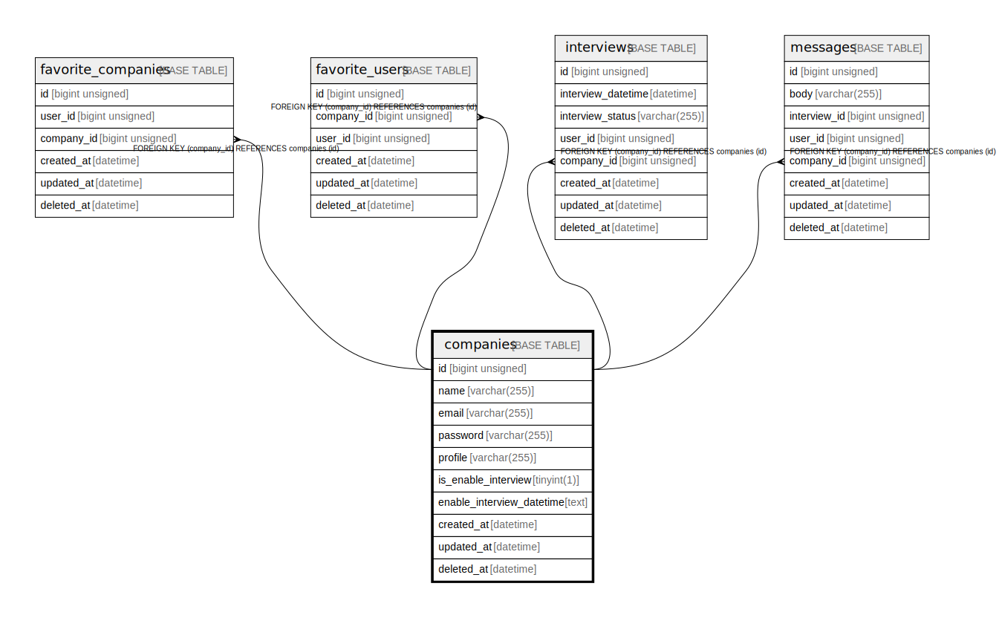

# companies

## Description

<details>
<summary><strong>Table Definition</strong></summary>

```sql
CREATE TABLE `companies` (
  `id` bigint unsigned NOT NULL AUTO_INCREMENT,
  `name` varchar(255) COLLATE utf8mb4_unicode_ci NOT NULL,
  `email` varchar(255) COLLATE utf8mb4_unicode_ci NOT NULL,
  `password` varchar(255) COLLATE utf8mb4_unicode_ci NOT NULL,
  `profile` varchar(255) COLLATE utf8mb4_unicode_ci NOT NULL,
  `is_enable_interview` tinyint(1) NOT NULL,
  `enable_interview_datetime` text COLLATE utf8mb4_unicode_ci NOT NULL,
  `created_at` timestamp NULL DEFAULT NULL,
  `updated_at` timestamp NULL DEFAULT NULL,
  `deleted_at` datetime NOT NULL,
  PRIMARY KEY (`id`),
  UNIQUE KEY `companies_email_unique` (`email`)
) ENGINE=InnoDB DEFAULT CHARSET=utf8mb4 COLLATE=utf8mb4_unicode_ci
```

</details>

## Columns

| Name | Type | Default | Nullable | Extra Definition | Children | Parents | Comment |
| ---- | ---- | ------- | -------- | ---------------- | -------- | ------- | ------- |
| id | bigint unsigned |  | false | auto_increment | [favorite_companies](favorite_companies.md) [favorite_users](favorite_users.md) [interviews](interviews.md) [messages](messages.md) |  |  |
| name | varchar(255) |  | false |  |  |  |  |
| email | varchar(255) |  | false |  |  |  |  |
| password | varchar(255) |  | false |  |  |  |  |
| profile | varchar(255) |  | false |  |  |  |  |
| is_enable_interview | tinyint(1) |  | false |  |  |  |  |
| enable_interview_datetime | text |  | false |  |  |  |  |
| created_at | timestamp |  | true |  |  |  |  |
| updated_at | timestamp |  | true |  |  |  |  |
| deleted_at | datetime |  | false |  |  |  |  |

## Constraints

| Name | Type | Definition |
| ---- | ---- | ---------- |
| companies_email_unique | UNIQUE | UNIQUE KEY companies_email_unique (email) |
| PRIMARY | PRIMARY KEY | PRIMARY KEY (id) |

## Indexes

| Name | Definition |
| ---- | ---------- |
| PRIMARY | PRIMARY KEY (id) USING BTREE |
| companies_email_unique | UNIQUE KEY companies_email_unique (email) USING BTREE |

## Relations



---

> Generated by [tbls](https://github.com/k1LoW/tbls)
