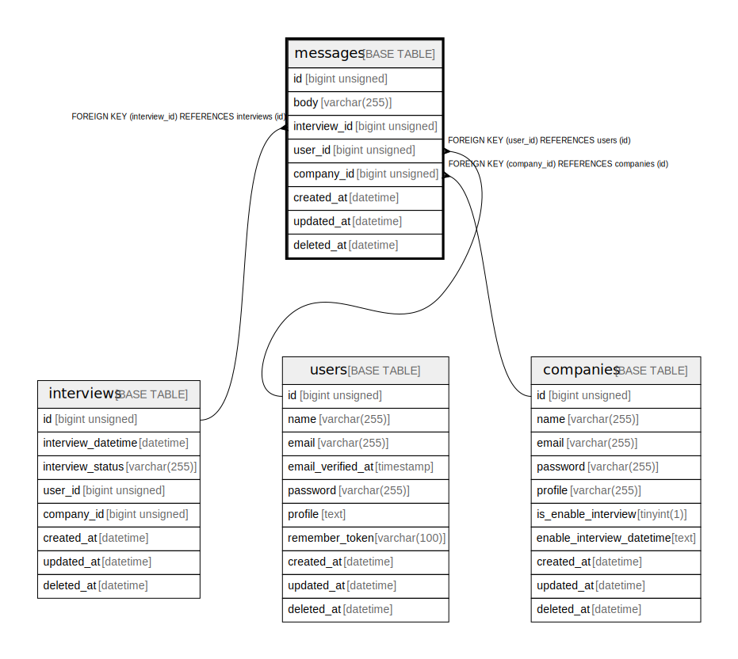

# messages

## Description

<details>
<summary><strong>Table Definition</strong></summary>

```sql
CREATE TABLE `messages` (
  `id` bigint unsigned NOT NULL AUTO_INCREMENT,
  `body` varchar(255) COLLATE utf8mb4_unicode_ci NOT NULL,
  `interview_id` bigint unsigned NOT NULL,
  `user_id` bigint unsigned NOT NULL,
  `company_id` bigint unsigned NOT NULL,
  `created_at` timestamp NULL DEFAULT NULL,
  `updated_at` timestamp NULL DEFAULT NULL,
  `deleted_at` datetime NOT NULL,
  PRIMARY KEY (`id`),
  KEY `messages_interview_id_foreign` (`interview_id`),
  KEY `messages_user_id_foreign` (`user_id`),
  KEY `messages_company_id_foreign` (`company_id`),
  CONSTRAINT `messages_company_id_foreign` FOREIGN KEY (`company_id`) REFERENCES `companies` (`id`),
  CONSTRAINT `messages_interview_id_foreign` FOREIGN KEY (`interview_id`) REFERENCES `interviews` (`id`),
  CONSTRAINT `messages_user_id_foreign` FOREIGN KEY (`user_id`) REFERENCES `users` (`id`)
) ENGINE=InnoDB DEFAULT CHARSET=utf8mb4 COLLATE=utf8mb4_unicode_ci
```

</details>

## Columns

| Name | Type | Default | Nullable | Extra Definition | Children | Parents | Comment |
| ---- | ---- | ------- | -------- | ---------------- | -------- | ------- | ------- |
| id | bigint unsigned |  | false | auto_increment |  |  |  |
| body | varchar(255) |  | false |  |  |  |  |
| interview_id | bigint unsigned |  | false |  |  | [interviews](interviews.md) |  |
| user_id | bigint unsigned |  | false |  |  | [users](users.md) |  |
| company_id | bigint unsigned |  | false |  |  | [companies](companies.md) |  |
| created_at | timestamp |  | true |  |  |  |  |
| updated_at | timestamp |  | true |  |  |  |  |
| deleted_at | datetime |  | false |  |  |  |  |

## Constraints

| Name | Type | Definition |
| ---- | ---- | ---------- |
| messages_company_id_foreign | FOREIGN KEY | FOREIGN KEY (company_id) REFERENCES companies (id) |
| messages_interview_id_foreign | FOREIGN KEY | FOREIGN KEY (interview_id) REFERENCES interviews (id) |
| messages_user_id_foreign | FOREIGN KEY | FOREIGN KEY (user_id) REFERENCES users (id) |
| PRIMARY | PRIMARY KEY | PRIMARY KEY (id) |

## Indexes

| Name | Definition |
| ---- | ---------- |
| messages_company_id_foreign | KEY messages_company_id_foreign (company_id) USING BTREE |
| messages_interview_id_foreign | KEY messages_interview_id_foreign (interview_id) USING BTREE |
| messages_user_id_foreign | KEY messages_user_id_foreign (user_id) USING BTREE |
| PRIMARY | PRIMARY KEY (id) USING BTREE |

## Relations



---

> Generated by [tbls](https://github.com/k1LoW/tbls)
